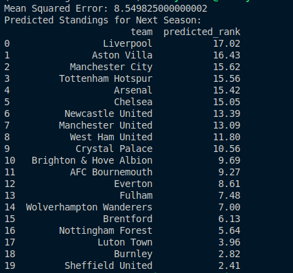

# Premier League Prediction Using Random Forest


This project predicts the standings of the 2024 Premier League season using historical match data and a Random Forest Regressor model.

## Project Overview

We utilize historical Premier League data to estimate team performance for the upcoming season. By calculating various performance metrics and training a machine learning model, we can forecast team standings.

## Data Preparation

1. **Data Loading**: Historical Premier League data is loaded from a CSV file.
2. **Feature Calculation**: We calculate features such as wins, draws, losses, average goals scored, and average goals conceded for each team.

## Feature Creation

We build a dataset using the calculated features, representing each team's performance metrics.

## Model Training

1. **Training**: We use a Random Forest Regressor to model the relationship between team performance metrics and their standings.
2. **Evaluation**: We assess the model's performance using Mean Squared Error (MSE) on a test set.

## Prediction

We use the trained model to predict the standings for the next season and sort the results by predicted rank to identify teams expected to perform better.

## Results

The predicted standings for the next season are displayed, with higher predicted ranks indicating better expected performance.



## Requirements

To run this project, you'll need:

- Python 3.x
- Pandas
- Scikit-learn
- numpy

You can install the required packages using pip:

```bash
pip install pandas scikit-learn numpy
```

## How to Run

1. Clone this repository:

    ```bash
    git clone https://github.com/Alazar42/2024-Premier-League-Prediction.git
    ```

2. Navigate to the project directory:

    ```bash
    cd 2024-Premier-League-Prediction
    ```

3. Run the prediction script:

    ```bash
    python main.py
    ```

## Acknowledgements

- The dataset used in this project is sourced from [https://kaggle.com](https://www.kaggle.com/datasets/danilocardoso/premier-league-20232024).
- Special thanks to the authors of the scikit-learn library for their comprehensive documentation and tools.
